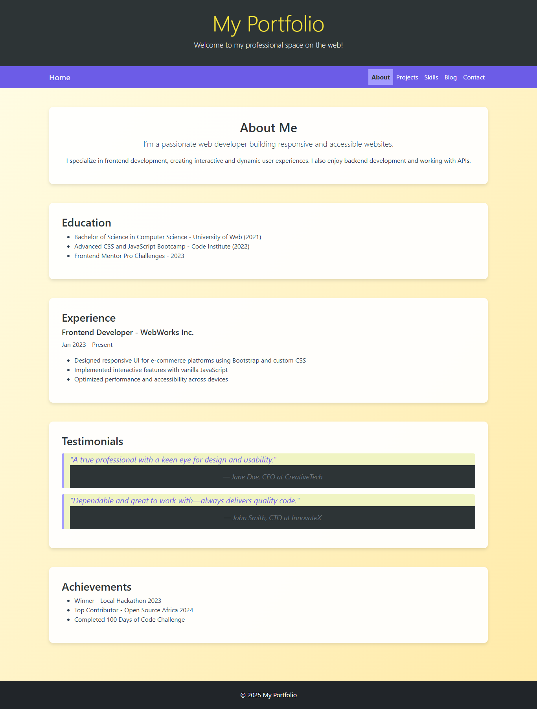

# 💥 Lab: *FixIt should look like: 


---

## 🎯 Objective
You're taking over a student portfolio site that's full of broken CSS.  
Your job is to **fix layout issues, repair responsiveness**, and **clean up the mess** using:

- The **cascade**
- **Selectors & specificity**
- **Media queries**
- **Bootstrap**
- **Flexbox or Grid**

> 📖 **For a complete overview of this lab, learning objectives, and lab structure, see the main [README.md](../README.md) in the root directory.**

It should look like: 
 the Portfolio!*

## 🎯 Objective
You're taking over a student portfolio site that’s full of broken CSS.  
Your job is to **fix layout issues, repair responsiveness**, and **clean up the mess** using:

- The **cascade**
- **Selectors & specificity**
- **Media queries**
- **Bootstrap**
- **Flexbox or Grid**

It should look like: 

---

##   **GitHub Instructions**

To start working on this project, follow these steps:

1. Fork and clone the Repository
Go to this GitHub repo link: https://github.com/onja-org/css_wave2_week2_fail_lab

2. Clone Your Fork to Your Computer  
Once you have forked the repo, copy the HTTPS URL.  
Open your terminal and run:

    ```
    git clone https://github.com/your-username/css_wave2_week2_fail_lab.git
    ```

3. Go into the project folder:

      ```
      cd css_wave2_week2_fail_lab
      ```  

4. Open in Visual Studio Code:
If you have VS Code installed

    ```
    code .
    ```

5. Start Working on the Project  
You can now start fixing the broken style in `lab/broken_file/style.css`

## 🧩 Starter Files
```
lab/broken_file/
├── index.html        ← ready written, messy layout
├── style.css         ← Broken and badly organized
```

## 🧪 Your Mission

Open up the html file in the browser. It looks really different than the image. Your goal is to make sure it looks like the image above. 

### 🧱 1. Layout & Spacing
- Use Bootstrap grid or Flexbox properly
- Make sure cards are aligned and spaced evenly
- Remove inline styles and use class-based styling

### 🎨 2. Visual Styling
- Use better fonts and consistent sizes
- Fix color contrast issues (light gray text on white background)

### 📱 3. Responsive Design
- Use media queries to fix text size and layout issues on mobile
- Make the nav collapse into a stacked layout or use Bootstrap’s navbar

### 🧠 4. Cascade & Specificity
- Clean up unnecessary `!important`
- Reorganize selectors so styles apply consistently

---

## 🔎 Optional Stretch Goals
- Make a light/dark mode toggle
- Add hover effects to project cards
- Add a working contact form layout (no backend needed)

---

## 🧪 BONUS "Easter Eggs" (Optional to Discover & Fix)
- A `display: none;` on the main content by mistake
- A media query that says `max-width: 160px` (so it never runs)
- An unused CSS rule for `.hidden-navbar` that is accidentally applied

---

## Test Your work 
Before submitting your task, you can run the automated tests to validate that your HTML and CSS structure meet the project requirements.

Run this in your terminal from the root directory:

```
npm test
```

## 🚀 Submission Instructions
1. Save all changes
2. Ensure your HTML is semantic and valid
3. Push your project to GitHub (or zip and upload if instructed)

### Git Quick Start (if needed):
```bash
git init
git add .
git commit -m "Fix broken portfolio layout and styling"
git remote add origin https://github.com/your-username/css_wave2_week2_fail_lab.git
git branch -M main
git push -u origin main
```

---

## 🌟 Stretch Yourself Further
- Turn this into your **actual portfolio** after fixing it
- Replace content with your own photo, bio, and projects
- Add animations or interactive elements